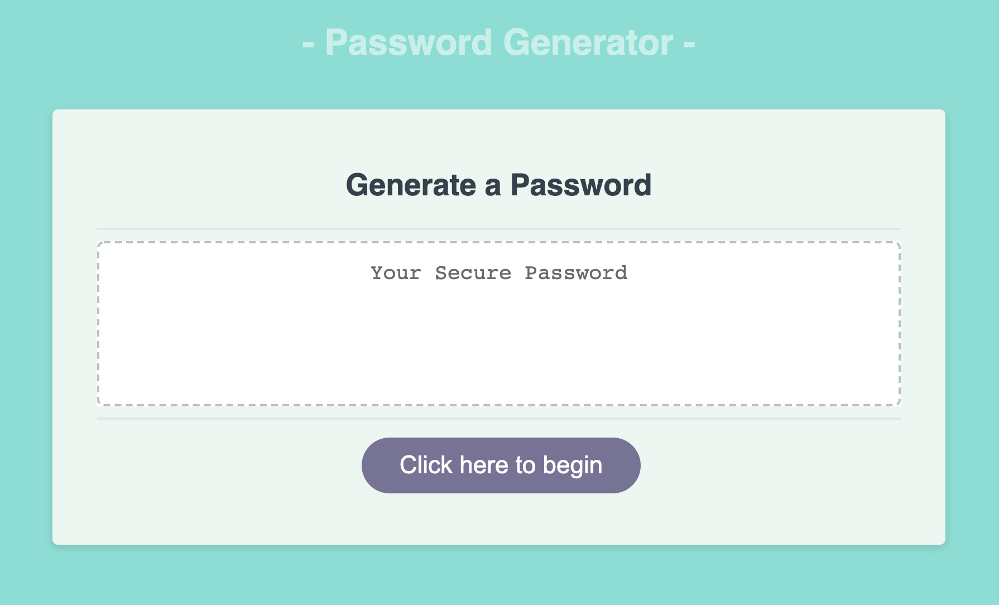

# Employee Password Generator

## Description
This application allows an employee to generate a random password based on criteria they’ve selected. This app runs in the browser, and features dynamically updated HTML and CSS powered by JavaScript code. It presents a clean and polished user interface that is responsive and adapts to multiple screen sizes.

<br> 

## User Narrative
As an employee with access to sensitive data, I want to randomly generate a password that meets certain criteria so that I can create a strong password that provides greater security.

<br>

## Performance Criteria
```
GIVEN I need a new, secure password

WHEN I click the button to generate a password
THEN I am presented with a series of prompts for password criteria

WHEN prompted for password criteria
THEN I select which criteria to include in the password

WHEN prompted for the length of the password
THEN I choose a length of at least 8 characters and no more than 128 characters

WHEN prompted for character types to include in the password
THEN I choose lowercase, uppercase, numeric, special, and/or emoji characters

WHEN I answer each prompt
THEN my input should be validated and at least one character type should be selected

WHEN all prompts are answered
THEN a password is generated that matches the selected criteria

WHEN the password is generated
THEN the password is either displayed in an alert or written to the page
```
<br>

## Deployed Application Link and Preview

Link: https://bracamon.github.io/EmployeePasswordGenerator/

The following image shows the web application's appearance and functionality:

